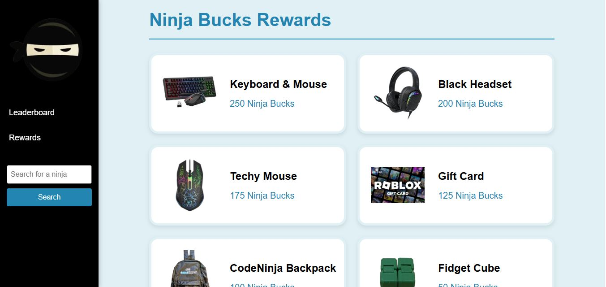

# NinjaBuck Portal Manager

A Django-based web application to manage Ninja Bucks at Code Ninjas Brampton South West .
Ninja Bucks are virtual points earned by students for completing game projects, attending coding sessions, and participating in events. This portal streamlines the tracking, rewarding, and redemption process for both students and instructors.

---

## Features

- Instructor portal to add Ninja Bucks to students
- Reward catalog with images and prices
- Students can redeem points for real-world items
- Admin interface for managing users, rewards, and redemptions
- Supports image uploads for reward visuals

---
### Screenshot


---
## Built With

- [Python](https://www.python.org/)
- [Django](https://www.djangoproject.com/)
- [SQLite / MySQL](https://www.mysql.com/) (planned migration to cloud-hosted DB)
- HTML, CSS, Django templates

---

## Setup & Installation

1. **Clone the repository**
   ```bash
   git clone https://github.com/yourusername/ninjabuckportalmanager.git
   cd ninjabuckportalmanager

2. **Create a virtual environment**
   ```bash
   python -m venv venv
   source venv/bin/activate (Windows: venv\Scripts\activate)

3. **Install dependencies**
   ```bash
   pip install -r requirements.txt

4. **Apply migrations**
   ```bash
   python manage.py migrate

5. **Create a superuser**
   ```bash
   python manage.py createsuperuser

6. **Run the development server**
   ```bash
   python manage.py runserver

7. **Access the app**
   ```bash
   http://localhost:8000


## Deployment Notes
- Use `python manage.py check --deploy` to audit your production settings.

## Future Improvements
- Multilingual support
- Google Sheets integration for redemptions
 
